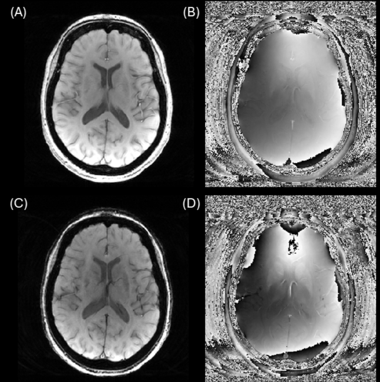
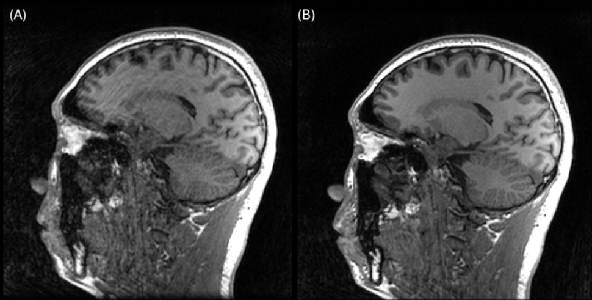
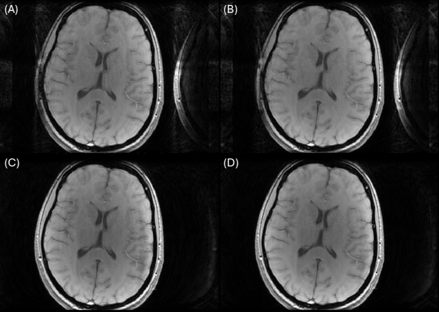
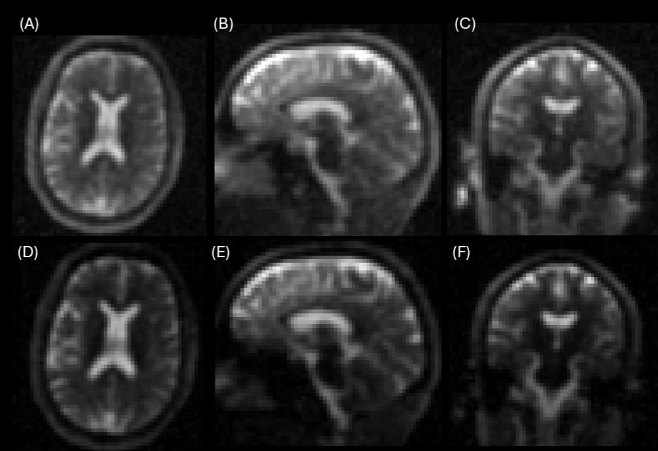

# Gadgetron Parallel Reconstruction Framework

**A practical framework for translating offline MR reconstructions to inline deployment, built on the open-source Gadgetron platform.**

---

## ✨ Key Features

### ✅ Easy Prototyping of Offline Reconstructions

* Converts ISMRMRD raw data into a **Twix-like structure** for minimal modification of existing offline code
* Provides a general-purpose **MATLAB-based input converter** and customizable **ParameterMap** covering commonly used headers

### ⚙️ Inline Execution Without Scanner Disruption

* Enables **long custom reconstructions** without interrupting the MR exam flow
* Inline reconstructions are executed **asynchronously** on an external server
* Supports **retrieval scans** and **retro-reconstruction**
* Scanner-native reconstructions are preserved for **early review**

### 🔁 Multi-input & Joint Reconstruction Support

* Allows inline reconstructions to access **shared or external input scans** (e.g., reference coils)

### 🧠 Resource-aware Parallel Scheduling

* Includes built-in GPU monitoring and queueing
* Schedules jobs intelligently across **multi-GPU servers** to avoid overloads

### 🧬 Integrated Scanner Post-processing

* Enables scanner-based post-processing (e.g., bias field and distortion correction) on custom reconstructions
* Ensures **visual consistency** with Siemens-reconstructed images

---

## 📁 Folder Structure

```
Gadgetron_Parallel_Framework/
│
├── ParameterMap/             # Metadata mapping (Twix → ISMRMRD)
├── config/                   # Gadget chain configuration files (*.xml)
├── matlab_handle_archive/    # MATLAB handlers for "Read & Save" and background recon
├── Gadgetron_tools/          # Input converters, Twix-like wrappers, utilities
├── Bash_script/              # Headless / queued job launchers
├── Useful_tools/             # Misc tools: ISMRMRD readers, resource monitors, etc.
├── SENSE_Recon_Demo/         # Demo: SENSE (offline + inline)
├── AlignSENSE_Recon_Demo/    # Demo: AlignSENSE (offline + inline)
├── radial_NUFFT_Demo/        # Demo: NUFFT recon for radial sequence (offline + inline)
```

---

## 🚀 Getting Started

### Requirements

* [Gadgetron](https://github.com/gadgetron/gadgetron)
* **MATLAB ≥ R2021a** with Gadgetron Toolbox
* **CUDA-enabled Conda environment** (for launching recon scripts)
* **Linux server with NVIDIA GPUs**
* **Siemens scanner with ICEGadgetron** integration

### 📖 Full Documentation

All setup instructions and tutorials are available at:

👉 [User Manual on Notion](https://shine-pond-caf.notion.site/User-manual-20961ff38021807f89a8fdcc819acd0b?source=copy_link)

---

## 🧪 Demo Cases

Inline implementations included:

- **SENSE**: `SENSE_Recon_Demo/`
   - Reference: Pruessmann KP et al., *SENSE: Sensitivity Encoding for Fast MRI*. MRM 1999. [DOI:10.1002/mrm.1910420526](https://doi.org/10.1002/mrm.1910420526)
  
  
  
  *Figure 1. SENSE reconstruction results of a SWI sequence using the inline demo script*
- **AlignSENSE**: `AlignSENSE_Recon_Demo/`
  - Reference:
    - L. Cordero-Grande, et al., *Sensitivity Encoding for Aligned Multishot Magnetic Resonance Reconstruction*. IEEE Transactions on Computational Imaging, 2016. [DOI: 10.1109/TCI.2016.2557069](https://ieeexplore.ieee.org/document/7457367)
    - L. Cordero-Grande, et al., *Motion-corrected MRI with DISORDER: Distributed and incoherent sample orders for reconstruction deblurring using encoding redundancy*. MRM. 2020. [DOI: 10.1002/mrm.28157](https://onlinelibrary.wiley.com/doi/10.1002/mrm.28157)



*Figure 2. AlignSENSE reconstruction results of a MPRAGE sequence using the inline demo script. (A) before MoCo; (B) after MoCo via AlignSENSE*



*Figure 3. AlignSENSE reconstruction results of a SWI sequence using the inline demo script. (A) before MoCo & using auto-calibration lines for coil sensitivity estimation; (B) after MoCo via AlignSENSE & using auto-calibration lines; (C) before MoCo & using an external reference for coil sensitivity estimation and reconstruct to a lager FOV (wrapping removed compared to A); (D) after MoCo via AlignSENSE & using an external reference*
    


- **radial NUFFT**: `radial_NUFFT_Demo/`
   - Reference: Blunck Y, et al., *3D-multi-echo radial imaging of 23 Na (3D-MERINA) for time-efficient multi-parameter tissue compartment mapping*. MRM, 2018. [DOI: 10.1002/mrm.26848](https://onlinelibrary.wiley.com/doi/10.1002/mrm.26848)
 


*Figure 4. NUFFT reconstruction results of a multi-echo GRE Sodium imaging sequence with radial trajectory using the inline demo script for three views (A,D, axial; B,E, sagittal; C,F, coronal; A-C, first echo; D-F, second echo)*

Each demo contains:

* Offline version
* Inline version (`inline/` subfolder)
* `diff/` subfolder showing minimal modifications for inline adaptation

The demo datasets (raws) can be downloaded at Zenodo: 
👉 [demo datasets at Zenodo](https://zenodo.org/uploads/15839027)

---

## ✅ Validation Summary

Validated on:

* **3T MAGNETOM Vida (XA60)** — tested with MPRAGE, FLAIR, SWI
* **7T MAGNETOM Terra X (XA60)** — tested with multi-echo radial GRE
* **TwinsUK cohort study on 3T MAGNETOM Vida** - applied on MPRAGE

  * N = 480 subjects
  * 99% successful inline retrieval rate (via retrieval scans or retro-recon)

---

## 📝 Citation

If you use this framework in your research, please cite:

> Ning Z, et al. (2025). A Framework for Inline Parallel Multi-Sequence Reconstructions: A Head Motion Correction Application. Proceedings of the International Society for Magnetic Resonance in Medicine (ISMRM), Abstract 0032.
> [In submission] Ning Z, et al. *"From Offline to Inline Without Pain: A Practical Framework for Translating Offline MR Reconstructions to Inline Deployment Using the Gadgetron Platform."* (2025)

---

## 📄 License

This project is released under the [MIT License](LICENSE).
